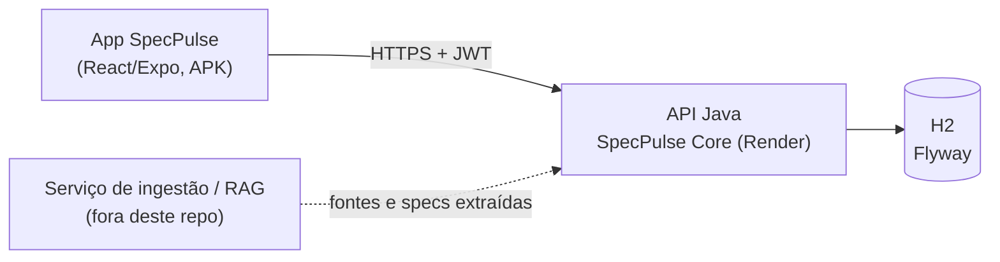
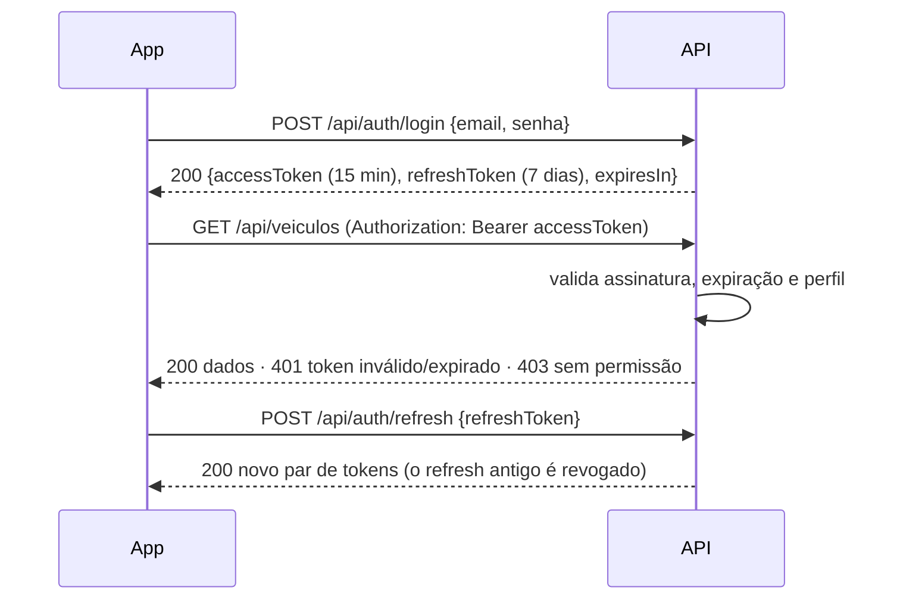

# Contexto do projeto — Ford SpecPulse Twin (API Java)

> Arquivo vivo. Guarda o contexto, o estado atual, as decisões e o histórico de tudo o que foi feito ou alterado neste repositório.
> Quem chega agora no projeto deve ler este arquivo primeiro. Como manter: seção 12.

**Última atualização:** 2026-09-25
**Repositório:** https://github.com/carloshadp/ford-spec-pulse-api

---

## 1. O projeto

**SpecPulse Twin** é um "gêmeo digital competitivo" para inteligência de mercado da Ford (Challenge FIAP & Ford, 3º ano).
Ele transforma fichas técnicas espalhadas em PDFs e sites em comparações normalizadas, gaps competitivos, valor percebido por perfil de cliente e recomendações, sempre com evidência rastreável até a fonte.

Este repositório é **a API REST em Java**. Quem consome é o app React/Expo Router, entregue como APK na disciplina de Mobile.

**Equipe**

| Nome | RM |
|---|---|
| Carlos Henrique | 558003 |
| Mauricio Alves | 556214 |
| Ian Monteiro | 558652 |
| Bruno Silva | 550416 |
| João Hoffmann | 550763 |

Scrum Master da challenge: Prof. Yan Coelho.

---

## 2. Linha do tempo e prazos

| Quando | Entrega | Situação |
|---|---|---|
| Mai/2026 | Sprints 1 e 2 (1º semestre): API base + requisitos de Cybersecurity (PR #1) | Entregue |
| 22/09/2026 | Deploy em container no Render | Feito |
| **27/09/2026** | **Sprint 3** — entrega da API na disciplina *Arquitetura Orientada a Serviços e Web Services* (tarefa no Teams) | Em andamento |
| 11/10/2026 | Sprint 4 — vídeo pitch + técnico de no máximo 6 min, o mesmo link em todas as disciplinas | A fazer |

A nota da challenge é a média das entregas e vale para **todas** as disciplinas.

---

## 3. Estado atual do código

### 3.1 Stack

Java 21 · Spring Boot 3.3.5 · Spring Security + OAuth2 Resource Server (JWT HS256 via Nimbus) · Spring Data JPA · Flyway · H2 em arquivo (`./data/specpulse`) · springdoc-openapi 2.6 · Lombok · Actuator.

Não há Maven Wrapper (`mvnw`) no repositório: é preciso JDK 21 e Maven 3.9+ instalados para rodar (`mvn spring-boot:run`).

### 3.2 Organização

Pacote raiz `com.ford.specpulse`, módulos por área, nomes em português:

```
com.ford.specpulse
├── config/          SecurityConfig, OpenApiConfig, JpaAuditingConfig
├── compartilhado/   RespostaLista, RespostaErro, ManipuladorGlobalExcecoes,
│                    RateLimitFilter, RequestIdFilter, SlugUtil, EntidadeBase
├── seguranca/       Perfil (5 perfis)
├── security/        BruteForceProtectionService
├── filter/          XssFilter, HmacSignatureFilter (HMAC desligado por padrão)
├── service/         DataRetentionService (retenção/anonimização agendada)
├── util/            LogMaskingUtils (mascara email, IP e JWT nos logs)
├── autenticacao/    login, register, refresh, logout, TokenServico
├── auditoria/       AuditoriaServico (assíncrono)
├── facade/api/      controllers expostos ao frontend + DTOs no formato do contrato
├── ficha/           consulta de ficha técnica por texto livre (sinônimos)
├── veiculo/ versao/ especificacao/ comparacao/   domínio + repositórios
```

Cada módulo segue `api` (controller + DTOs) → `dominio` (entidades + serviços) → `persistencia` (repositórios).
Os controllers do pacote `facade` devolvem JSON com os nomes de campo do contrato em inglês (`referenceVersionId`, `confidenceLevel`, `evidenceIds`...).

### 3.3 Banco e dados iniciais (Flyway)

| Migration | Conteúdo |
|---|---|
| V1 | Schema: marcas, veículos, versões, atributos, especificações, fontes, comparações |
| V2 | Ranger XLT, Hilux SRX, S10 High Country, Amarok Highline |
| V3 | Sinônimos de atributos + **Ranger Raptor** com specs reais |
| V4 | Usuários e refresh tokens |
| V5 | Auditoria |
| V6 | Specs ampliadas (23 por versão) |
| V7 | Reclassificação de categorias de atributos |
| V8 | L200 Triton Sport HPE, Frontier Pro-4X, Toro Ultra |

Usuários de teste (um por perfil) estão no README: `leitor@`, `analista@`, `gerente@`, `validador@`, `admin@ford.internal`.

### 3.4 Segurança já implementada

- JWT HS256: access token de 15 min, refresh token de 7 dias com rotação e revogação no logout. Segredo via `SPECPULSE_JWT_SEGREDO` (mínimo 32 caracteres).
- 5 perfis com controle por rota no `SecurityConfig` (ver 5.4).
- Rotas públicas: `POST /api/auth/login|register|refresh`, Swagger, `/actuator/health` e `/h2-console` (só em dev).
- Rate limit em memória: 60 req/min geral e 10 req/min em `/api/auth/*`, respondendo 429.
- Proteção contra força bruta no login (bloqueio por IP).
- Headers de segurança (CSP, HSTS, frame-options), filtro XSS, validação nos DTOs de entrada.
- Auditoria de login, registro, comparações, alterações de usuário e acessos negados (403).
- Logs com `requestId` em todas as linhas; no perfil `prod`, saem em JSON.

### 3.5 Deploy

- Docker multi-stage (`Dockerfile`) + Blueprint do Render (`render.yaml`), plano free, deploy automático a cada commit na `main`.
- Perfil `prod` (`application-prod.properties`): desliga o console H2, não expõe stack trace e confia no HTTPS do proxy do Render.
- O H2 grava dentro do container: **os dados voltam ao seed a cada deploy**.
- URL pública: *a registrar aqui*.

### 3.6 O que ainda não existe

- **Nenhum teste automatizado** (não há `src/test`). É a maior lacuna para a Sprint 3.
- Diagramas de arquitetura e do fluxo de autenticação.
- Gaps, recomendações, valor percebido, histórico, radar, relatórios, data quality e uploads: só stubs que devolvem lista vazia, ou nada (ver seção 5).
- Pipeline de CI.

---

## 4. Sprint 3 — rubrica da disciplina SOA & Web Services × situação atual

| Critério | Peso | O que a FIAP pede | Situação hoje | O que falta |
|---|---:|---|---|---|
| Arquitetura da solução | 20% | Diagrama de componentes e responsabilidades; separação de responsabilidades; fluxo de comunicação e autenticação | ⚠️ README tem estrutura de pacotes e modelo de dados em texto | Diagrama de componentes e diagrama de sequência do login/JWT |
| Maturidade REST nível 2 | 20% | Recursos, métodos HTTP corretos, status codes coerentes | ⚠️ Recursos e verbos ok; `201` em criação, `204` no logout, `422` em regra de negócio | Padronizar prefixo (`/api` × `/api/v1`); `201` sai sem header `Location`; erro 500 sai com código `SERVICE_UNAVAILABLE` |
| Autenticação e autorização | 20% | Endpoints públicos e protegidos; perfis diferentes | ✅ Feito | Só evidenciar nos testes |
| JWT | 15% | Geração, validação, expiração, uso das claims | ✅ Feito (inclui refresh) | Só evidenciar nos testes |
| Testes automatizados | 15% | Sucesso, erro e acesso não autorizado; evidência de execução | ❌ Não existe | Testes de integração com MockMvc + relatório e prints |
| Documentação e erros | 10% | Swagger, erros padronizados, README | ✅ Swagger e `RespostaErro` ok | README desatualizado (cita migrations V1–V7; falta V8, deploy e testes) |

**Outras disciplinas que tocam este repositório**

- **Cybersecurity (DevSecOps):** pede pipeline CI com SAST, SCA e secret scanning, além de evidências de hardening e logs estruturados. Boa parte do hardening já existe (seção 3.4); falta o pipeline.
- **Testing & QA:** backlog no Azure DevOps (fora do repo). Os épicos e features devem bater com os módulos daqui.
- **Mobile:** o APK em celular físico precisa da URL pública do Render, não de `localhost`.
- **IA & ML:** notebook separado. Na arquitetura, aparece como serviço externo de ingestão e extração.

---

## 5. Contrato do frontend × implementação

O contrato completo está em `java-api-endpoint-prompt.md` (ver seção 10). Ele define 48 endpoints em inglês.

### 5.1 Convenções do contrato

- Base `/api`, JSON, datas ISO 8601 em UTC.
- IDs string estáveis (`brand-ford`, `version-...`, `attr_...`). **Implementação:** UUID internamente, mas todas as rotas aceitam UUID ou slug.
- Listagem: `{ data, page, pageSize, total }`. **Implementação:** `RespostaLista`, igual ao contrato.
- Erro: `{ code, message, requestId, details }`. **Implementação:** `RespostaErro` traz esses campos e mais `timestamp`, `status` e `path`; `details` é uma lista de erros por campo, não um objeto.

### 5.2 Situação por área

✅ implementado · 🟡 stub (devolve lista vazia) · ❌ não existe · ↔ rota diferente da do contrato

| Área | Contrato | Implementação atual | Status |
|---|---|---|---|
| Auth | — (contrato não prevê login) | `POST /api/auth/login`, `/register`, `/refresh`, `/logout` | ✅ extra |
| Usuários | `GET /users/me` | `GET /api/usuarios/me` e alias `/api/users/me` | ✅ |
| | `GET /users` | `GET /api/usuarios` (e `/api/users`) | ✅ |
| | `PATCH /users/{id}/roles` | `PATCH /api/usuarios/{id}` (perfil e/ou ativo) | ✅ ↔ |
| Catálogo | `GET /brands` | `GET /api/marcas` (+ `/api/marcas/{id}`) | ✅ ↔ |
| | `GET /vehicles`, `/vehicles/{id}`, `/vehicles/{id}/versions` | `GET /api/veiculos`, `/{id}`, `/{id}/versoes` | ✅ ↔ |
| | `GET /versions/{id}`, `/versions/{id}/specifications` | `GET /api/versoes/{id}`, `/{id}/especificacoes` | ✅ ↔ |
| | `GET /versions/{id}/sources` | `GET /api/versoes/{id}/fontes` | 🟡 ↔ |
| | `GET /sources/{id}` | `GET /api/v1/fontes/{id}` (+ `/api/v1/fontes`, `/api/v1/especificacoes/{id}`) | ✅ ↔ |
| Taxonomia | `GET /attributes/taxonomy` | `GET /api/atributos/taxonomia` | ✅ ↔ |
| | `POST /attributes`, `PATCH /attributes/{id}`, `POST .../synonyms`, `POST /attributes/merge` | — | ❌ |
| Comparações | `POST /comparisons`, `GET /comparisons/{id}`, `GET .../matrix` | `POST /api/comparacoes` (201), `GET /{id}`, `GET /{id}/matriz` (+ `GET /api/comparacoes`) | ✅ ↔ |
| | `POST .../save`, `POST .../duplicate` | — | ❌ |
| Gaps | `GET /gaps`, `GET /comparisons/{id}/gaps` | `GET /api/lacunas`, `/api/comparacoes/{id}/lacunas`; `gaps` sai vazio na comparação | 🟡 ↔ |
| Valor percebido | 4 endpoints | `GET /api/perfis-clientes` | 🟡 ↔ / ❌ |
| Recomendações | GET, POST, PATCH | `GET /api/recomendacoes` | 🟡 ↔ / ❌ |
| Histórico | 4 endpoints | `GET /api/historico-analises` | 🟡 ↔ / ❌ |
| Relatórios | export, status, download | `POST /api/relatorios/exportar`, `GET /api/relatorios/{id}` | 🟡 ↔ / ❌ |
| Data quality | GET lista, GET item, PATCH | `GET /api/qualidade-dados/itens` | 🟡 ↔ / ❌ |
| Radar | 4 endpoints | `GET /api/alertas-mercado` | 🟡 ↔ / ❌ |
| Uploads | 3 endpoints | `GET /api/uploads` | 🟡 / ❌ |
| Auditoria | `GET /admin/audit-log` | `GET /api/admin/registro-auditoria` | ✅ ↔ |
| Ficha técnica | — (não está no contrato) | `POST /api/fichas-tecnicas/consultar` (marca + modelo + versão + atributos em texto livre) | ✅ extra |

**Contagem:** dos 48 endpoints do contrato, 15 funcionam, 11 são stub e 22 não existem.

### 5.3 Regras de negócio do contrato

1. `not_available` = ausência **confirmada** por fonte. `not_informed` = a fonte não confirma nem nega. Nunca tratar um como o outro. *(Código: `StatusEspecificacao.NAO_INFORMADO` existe e a comparação o trata separado.)*
2. `conflict` = fontes divergem. `pending_validation` = valor candidato ainda não validado.
3. Gap só nasce de dado confirmado. `not_informed` vira pendência, nunca gap. *(Gaps ainda não implementados.)*
4. Gap com `confidence < 0.65` aparece como cautela.
5. Toda spec relevante tem `status`, `confidence` (0 a 1), `confidenceLevel`, `evidenceIds`, `updatedAt`.
6. Toda recomendação tem `rationale`, `confidence`, `evidenceIds`, `gapIds`, `status`. Sem evidência ou com baixa confiança → `requires_validation`.
7. Resolver item de data quality atualiza a spec, grava auditoria e marca comparações afetadas como desatualizadas.
8. Scores de valor percebido vão de 0 a 100, sempre com `drivers` textuais.
9. Comparação aceita de 1 a 3 concorrentes no MVP.

### 5.4 Perfis

| Contrato | Código (`Perfil`) | Ler | Criar comparação | Validar dados | Admin (usuários, auditoria) |
|---|---|---|---|---|---|
| `read_only` | `SOMENTE_LEITURA` | Sim | Não | Não | Não |
| `analyst` | `ANALISTA` | Sim | Sim | Não | Não |
| `manager` | `GERENTE` | Sim | Sim | Não | Não |
| `data_validator` | `VALIDADOR_DADOS` | Sim | Não | Sim | Não |
| `admin` | `ADMINISTRADOR` | Sim | Sim | Sim | Sim |

---

## 6. Decisões

Status: **Implementado** (já está no código) · **Proposto** (falta a equipe confirmar) · **Substituído** (não vale mais; manter a linha e apontar a nova).

| # | Decisão | Status | Motivo / observação |
|---|---|---|---|
| D1 | Java 21 + Spring Boot 3.3.5, JPA, Flyway, H2, springdoc | Implementado | Sprints 1 e 2 |
| D2 | Monólito modular com pacotes por área e camadas `api → dominio → persistencia` | Implementado | Cumpre o papel do serviço "Core" da arquitetura; ingestão e IA ficam como serviços externos |
| D3 | Login próprio com JWT HS256 (access 15 min + refresh 7 dias rotacionado), em vez do SSO do pitch | Implementado | Rubrica exige geração e validação de JWT; SSO fica como evolução |
| D4 | IDs UUID no banco, mas rotas aceitam UUID ou slug | Implementado | Frontend usa slugs estáveis |
| D5 | Rotas em português (`/api/marcas`, `/api/veiculos`...), com nomes de campo JSON em inglês | Implementado — **rever** | Diverge do contrato. Confirmar com o frontend qual caminho ele chama (ver 8.1) |
| D6 | Regra de negócio violada → `422 BUSINESS_RULE_VIOLATION` | Implementado | Não existe no contrato, mas é coerente com REST |
| D7 | Comparação é um snapshot imutável dos valores | Implementado | Mudança posterior em spec não altera comparação já criada |
| D8 | Confiança guardada como nível (ALTA/MEDIA/BAIXA) e convertida em número fixo (0.9 / 0.65 / 0.35) | Implementado — **rever** | O contrato prevê o contrário: número de 0 a 1, com o nível derivado dele. Com MEDIA = 0.65, nenhum dado médio cai na regra de cautela `< 0.65` |
| D9 | SOAP (Apache CXF) e perfil Oracle removidos | Implementado | Commit `3267c54`; simplificação |
| D10 | Deploy Docker no Render com perfil `prod` | Implementado | Substitui o deploy no Railway de mai/2026 |
| D11 | Testes de integração com `@SpringBootTest` + MockMvc cobrindo sucesso, 400, 401, 403 e 404 | Proposto | Rubrica de testes (15%) |
| D12 | Comparação entre segmentos diferentes gera aviso em `validationWarnings`, não 409 | Proposto | O contrato aceita os dois caminhos |
| D13 | Gaps e recomendações por regras determinísticas no MVP | Proposto | O próprio contrato pede priorizar contrato a algoritmo |
| D14 | Campos `stale` e `sourceRevision` para comparações afetadas por correção de dados | Proposto | O contrato pede marcar desatualizado, mas não tem campo |

---

## 7. Arquitetura

### 7.1 Componentes (proposta de diagrama para a entrega)



Ordem atual dos filtros, pelo `@Order` de cada um: `XssFilter` → `HmacSignatureFilter` → Spring Security (JWT e perfil) → `RateLimitFilter` → `RequestIdFilter` → controller → serviço → repositório.

Consequências: as respostas 401 e 403 saem com `requestId: "n/a"`, porque o ID ainda não foi gerado. Requisições sem token recebem 401 antes de passar pelo rate limit.

### 7.2 Fluxo de autenticação



---

## 8. Pendências e dúvidas

### 8.1 Precisa decidir com a equipe

- **Rotas em português × contrato em inglês:** o app chama `/api/vehicles` ou `/api/veiculos`? Se chama em inglês, o app quebra em quase todas as telas. Opções: aliases em inglês (como já existe para `/api/users`) ou atualizar o contrato.
- **Prefixo `/api/v1`:** `EspecificacaoControlador` e `FonteControlador` usam `/api/v1`; o resto usa `/api`. Unificar.
- **Confiança numérica** (D8).
- **`requestId` nos erros 401 e 403:** hoje sai `"n/a"`, porque o `RequestIdFilter` roda depois do Spring Security (ver 7.1). Correção simples: dar ao filtro uma ordem anterior à do Security.
- **`/api/auth/register` público em produção:** qualquer pessoa cria conta `read_only`. Aceitável para a demo, mas vale registrar como risco (ou fechar em `prod`).

### 8.2 Schemas que o contrato usa sem definir

`ComparisonCell`, `CompetitiveGap` + `GapType`, `CustomerProfile`, `PerceivedValueScore`, `Recommendation` + `RecommendationStatus`, `AnalysisHistoryItem`, `ReportExportResult`, `MarketAlert` + `AlertSeverity`, `DataQualityItem`, enums `SourceType` e `reliability`, enum `versionLevel`.
Os tipos TypeScript do app provavelmente já têm o formato certo.

### 8.3 Prometido no pitch, fora do contrato

- Radar de **preços** rivais (analista de pricing): não há categoria de preço nem alerta de mudança de preço.
- Alertas por Teams e email.

---

## 9. Plano para a Sprint 3 (prazo 27/09) — proposto

A rubrica avalia qualidade de REST, segurança, testes e documentação, não quantidade de endpoints. Autenticação e JWT já estão prontos; o foco é fechar o que vale nota.

**Essencial**
- [ ] Testes automatizados: login ok/erro, 401 sem token, 403 por perfil, 404, 400 de validação, criação de comparação (201)
- [ ] Evidência dos testes (relatório do Maven + prints) no README
- [ ] Diagramas de componentes e de autenticação (seção 7) no README ou em `docs/`
- [ ] Unificar prefixo `/api` × `/api/v1`
- [ ] `RequestIdFilter` antes do Spring Security, para 401 e 403 terem `requestId`
- [ ] Header `Location` nas respostas 201
- [ ] Atualizar README (V8, deploy no Render, como rodar os testes, URL pública)

**Se der tempo**
- [ ] Gaps reais a partir da comparação (regras 3 e 4 da seção 5.3)
- [ ] Resolver a questão das rotas em português × inglês
- [ ] GitHub Actions: build + testes, SAST, SCA (Dependabot) e secret scanning (vale também para Cybersecurity)

**Depois da Sprint 3**
- [ ] Valor percebido, recomendações, histórico, radar, relatórios, data quality, uploads

---

## 10. Documentos de referência

| Documento | O que é | Onde está |
|---|---|---|
| `java-api-endpoint-prompt.md` | Contrato da API que o frontend espera | Só no computador do Ian — **pendente copiar para `docs/`** |
| `Ford SpecPulse Twin.pdf` | Pitch da solução (problema, canvas, roadmap, riscos) | idem |
| `Ford_V2.pdf` | Regras da FIAP, cronograma e critérios de cada disciplina | idem |

Pontos do pitch que afetam a API: mitigação de alucinação por "evidência raiz obrigatória" (daí `evidenceIds`), MVP validado com a Ranger Raptor, metas de resposta em menos de 3 min, alerta em até 2h e disponibilidade de 99.9%.

---

## 11. Histórico de alterações

| Data | Quem | O que mudou | Arquivos / commits |
|---|---|---|---|
| 2026-05-23 | Carlos | README inicial e primeira versão da API: catálogo, especificações, comparações, ficha técnica, auth JWT, seed de usuários e carros, deploy no Railway | `2afb376` … `67841c8` |
| 2026-05-24 | Ian | Sprint de Cybersecurity (PR #1): filtros XSS/HMAC/rate limit, proteção contra força bruta, retenção de dados, headers de segurança, validação de DTOs, mascaramento de logs. SOAP e Oracle entraram e depois foram removidos | `06d6d21` … `3267c54` |
| 2026-05-24 | Carlos | Ajustes de CORS, porta, Swagger e conexão H2; merge do PR #1 | `36bbbaf`, `6c0837e` |
| 2026-09-22 | Carlos | Deploy em container no Render (`Dockerfile`, `render.yaml`, perfil `prod`) | `8ffc6c6`, `4bee448` |
| 2026-09-25 | Ian | Análise do contrato do frontend, do pitch e da rubrica da Sprint 3 contra o código. Criação deste arquivo | `contexto.md` |

---

## 12. Como manter este arquivo

- Toda alteração relevante ganha uma linha na seção 11 (data, quem, o que mudou, arquivos ou commits).
- Decisão nova ou alterada vai na seção 6. Não apague decisões antigas: marque como **Substituído** e aponte a nova.
- Endpoint implementado: atualize a tabela 5.2 e a contagem.
- Pendência resolvida: tire da seção 8 e registre a decisão na seção 6.
- Tarefa concluída: marque na seção 9 e ajuste a seção 3.
- Atualize a data de "Última atualização" no topo.
